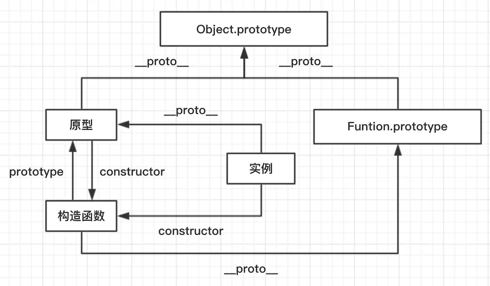

1. 原型 / 构造函数 / 实例

原型的概念: 什么叫原型呢？每个函数在创建的时候，都会有一个 `prototype` 属性，该属性指向了一个对象，这个对象我们就叫做原型对象。

原型有什么作用呢：它能够解决实例对象的属性、方法共享问题。


- 原型 `(prototype)`: 一个简单的对象，用于实现对象的 属性继承。可以简单的理解成对象的爹。
在 `Firefox` 和 `Chrome` 中，每个`JavaScript`对象中都包含一个 `__proto__` (非标准)的属性指向它爹(该对象的原型)，
可 `obj.__proto__` 进行访问。

- 构造函数: 可以通过 `new`来 新建一个对象 的函数。

- 实例: 通过构造函数和 `new` 创建出来的对象，便是实例。 实例通过 `__proto__` 指向原型，通过 `constructor` 指向构造函数。

- 说了一大堆，大家可能有点懵逼，这里来举个栗子，以`Object` 为例，我们常用的`Object`便是一个构造函数，因此我们可以通过它构建实例。


```js
// 实例
const instance = new Object()
```


此时， 实例为 `instance`, 构造函数为 `Object`，我们知道，构造函数拥有一个 `prototype` 的属性指向原型，因此原型为:

```js
// 原型
const prototype = Object.prototype
```

这里我们可以来看出三者的关系:

```js
实例.__proto__ === 原型

原型.constructor === 构造函数

构造函数.prototype === 原型

// 这条线其实是是基于原型进行获取的，可以理解成一条基于原型的映射线
// 例如: 
// const o = new Object()
// o.constructor === Object   --> true
// o.__proto__ = null;
// o.constructor === Object   --> false
实例.constructor === 构造函数

```

放大来看，我画了张图供大家彻底理解:




2. 原型链

**原型链是由原型对象组成**, 每个对象都有 `__proto__` 属性，指向了创建该对象的构造函数的原型，`__proto__` 将对象连接起来组成了原型链。是一个用来实现继承和共享属性的有限的对象链。

- 属性查找机制: 当查找对象的属性时，如果实例对象自身不存在该属性，则沿着原型链往上一级查找，找到时则输出，不存在时，则继续沿着原型链往上一级查找，直至最顶级的原型对象 `Object.prototype`，如还是没找到，则输出 `undefined`；

- 属性修改机制: 只会修改实例对象本身的属性，如果不存在，则进行添加该属性，如果需要修改原型的属性时，则可以用: `b.prototype.x = 2；`但是这样会造成所有继承于该对象的实例的属性发生改变。

