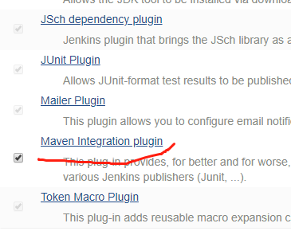

##  创建Jenkins容器

`Jenkins`采用 `Java` 开发，也需要`Java`环境，
但我们使用 `Docker`后，一切都采用容器化部署，`Jenkins`也不例外。

- 拉取镜像
  这里我们使用Jenkins官方提供的镜像，大家只需执行如下命令拉取即可：
  `docker pull docker.io/jenkins/jenkins`
- 启动容器
  由于`Jenkins`运行在`Tomcat`容器中，因此我们将容器的`8080`端口映射到宿主机的`10080`端口上：
  `docker run --name jenkins -p 10080:8080 docker.io/jenkins/jenkins`
- 初始化Jenkins
  然后你需要访问 `IP:10080`，`Jenkins`会带着你进行一系列的初始化设置，你只要跟着它一步步走就行了，比较傻瓜式。

## 在Jenkins中创建项目

### 安装 maven 插件

找到 “系统管理“ - “安装插件” ，点击 “可选插件”，找到如下 `maven` 插件的版本

